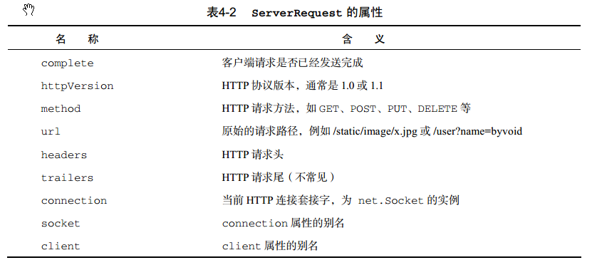
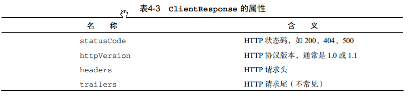

# My-Node.js

Node.js笔记

Node.js核心模块：

- 全局对象 global

- 常用工具 util

- 事件机制

- 文件访问系统

- HTTP服务器与客户端

----------

- 设计高性能web服务器的要点：事件驱动，非阻塞I/O

- 在Node中，模块分为两类：一类是Node提供的模块，称为核心模块；另一类是用户编写的模块，称为用户模块

- Node.js 所有的异步 I/O 操作在完成时都会发送一个事件到事件队列

- 

## 全局对象 ##

- global 最根本的作用是作为全局变量的宿主。按照 ECMAScript 的定义，满足以下条件的变量是全局变量：
	- 在最外层定义的变量；
	- 全局对象的属性；
	- 隐式定义的变量（未定义直接赋值的变量）。

- process 是一个全局变量，即 global 对象的属性。它用于描述当前 Node.js 进程状态
的对象，提供了一个与操作系统的简单接口

- console 用于提供控制台标准输出

## 常用工具 ##

- util 是一个 Node.js 核心模块，提供常用函数的集合

- util.inherits(constructor, superConstructor)是一个实现对象间原型继承
的函数，只继承原型中的属性和方法，不继承实例中的属性和方法

- util.inspect(object,[showHidden],[depth],[colors])是一个将任意对象转换
为字符串的方法，通常用于调试和错误输出

## 事件驱动 events ##

- events 模块只提供了一个对象： events.EventEmitter。 EventEmitter 的核心就
是事件发射与事件监听器功能的封装，EventEmitter 的每个事件由一个事件名和若干个参
数组成，事件名是一个字符串

- EventEmitter 支持若干个事件监听器。当事件发射时，注册到这个事件的事件监听器被依次调用，事件参数作为回调函数参数传递

- EventEmitter常用的API
 
	- EventEmitter.on(event, listener) 为指定事件注册一个监听器，接受一个字
	符串 event 和一个回调函数 listener。

	- EventEmitter.emit(event, [arg1], [arg2], [...]) 发射 event 事件，传
	递若干可选参数到事件监听器的参数表。

	- EventEmitter.once(event, listener) 为指定事件注册一个单次监听器，即
	监听器最多只会触发一次，触发后立刻解除该监听器。

	- EventEmitter.removeListener(event, listener) 移除指定事件的某个监听
	器， listener 必须是该事件已经注册过的监听器

	- EventEmitter.removeAllListeners([event]) 移除所有事件的所有监听器，
	如果指定 event，则移除指定事件的所有监听器

- error 事件，我们在遇到异常的时候通常会发射 error 事件。当 error 被发射时，EventEmitter 规定如果没有响应的监听器， Node.js 会把它当作异常，退出程序并打印调用栈。一般要为会发射 error事件的对象设置监听器，避免遇到错误后整个程序崩溃

- 大多数时候我们不会直接使用 EventEmitter，而是在对象中继承它。包括 fs、 net、
http 在内的，只要是支持事件响应的核心模块都是 EventEmitter 的子类

## 文件系统 fs ##

- fs 模块是文件操作的封装，它提供了文件的读取、写入、更名、删除、遍历目录、链接等 POSIX 文件系统操作，fs 模块中所有的操作都提供了异步的和同步的两个版本

- fs.readFile(filename,[encoding],[callback(err,data)])是最简单的读取文件的函数。它接受一个必选参数 filename，表示要读取的文件名。第二个参数 encoding是可选的，表示文件的字符编码。 callback 是回调函数，用于接收文件的内容

- s.readFileSync(filename, [encoding])是 fs.readFile 同步的版本。它接受的参数和 fs.readFile 相同，而读取到的文件内容会以函数返回值的形式返回，如果有错误发生， fs 将会抛出异常，你需要使用 try 和 catch 捕捉并处理异常

- fs.open(path, flags, [mode], [callback(err, fd)])是 POSIX open 函数的
封装，与 C 语言标准库中的 fopen 函数类似。它接受两个必选参数， path 为文件的路径，
flags 可以是以下值：

	- r ：以读取模式打开文件。
	- r+ ：以读写模式打开文件。
	- w ：以写入模式打开文件，如果文件不存在则创建。
	- w+ ：以读写模式打开文件，如果文件不存在则创建。
	- a ：以追加模式打开文件，如果文件不存在则创建。
	- a+ ：以读取追加模式打开文件，如果文件不存在则创建
	
mode 参数用于创建文件时给文件指定权限，默认是 0666①。回调函数将会传递一个文件描述符 fd

- fs.read(fd, buffer, offset, length, position, [callback(err, bytesRead,
buffer)])是 POSIX read 函数的封装，相比 fs.readFile 提供了更底层的接口。fs.read
的功能是从指定的文件描述符 fd 中读取数据并写入 buffer 指向的缓冲区对象。 offset 是
buffer 的写入偏移量。 length 是要从文件中读取的字节数。 position 是文件读取的起始
位置，如果 position 的值为 null，则会从当前文件指针的位置读取。回调函数传递
bytesRead 和 buffer，分别表示读取的字节数和缓冲区对象

## HTTP服务器和客户端 ##

- Node.js 标准库提供了 http 模块，其中封装了一个高效的 HTTP 服务器和一个简易的
HTTP客户端，http.Server 是一个基于事件的 HTTP服务器，http.request 则是一个
HTTP 客户端工具，用于向 HTTP 服务器发起请求

- HTTP服务器

	- http.Server 是 http 模块中的 HTTP 服务器对象，用 Node.js 做的所有基于 HTTP 协
议的系统，如网站、社交应用甚至代理服务器，都是基于 http.Server 实现的

	- http.createServer 创建了一个 http.Server 的实例，将一个函数作为 HTTP 请求处理函数。这个函数接受两个参数，分别是请求对象（ req ）和响应对象（ res ）

		- http.Server 是一个基于事件的 HTTP 服务器，所有的请求都被封装为独立的事件
		- request：当客户端请求到来时，该事件被触发，提供两个参数 req 和res，分别是
		http.ServerRequest 和 http.ServerResponse 的实例，表示请求和响应信息。http提供了一个捷径：http.createServer([requestListener]) ，功能是创建一个HTTP服务器并将requestListener 作为 request 事件的监听函数
		- connection：当 TCP 连接建立时，该事件被触发，提供一个参数 socket，为
		net.Socket 的实例。 connection 事件的粒度要大于 request，因为客户端在
		Keep-Alive 模式下可能会在同一个连接内发送多次请求。
		- close ：当服务器关闭时，该事件被触发。注意不是在用户连接断开时

	- http.ServerRequest 是 HTTP 请求的信息，是后端开发者最关注的内容。它一般由http.Server 的 request 事件发送，作为第一个参数传递，通常简称 request 或 req。HTTP 请求一般可以分为两部分： 请求头（Request Header）和请求体（Requset Body），

		- data ：当请求体数据到来时，该事件被触发。该事件提供一个参数 chunk，表示接
		收到的数据。如果该事件没有被监听，那么请求体将会被抛弃。该事件可能会被调
		用多次。
		- end ：当请求体数据传输完成时，该事件被触发，此后将不会再有数据到来。
		- close： 用户当前请求结束时，该事件被触发。不同于 end，如果用户强制终止了
		传输，也还是调用close。

	

	- http.ServerResponse 是返回给客户端的信息，决定了用户最终能看到的结果。它也是由 http.Server 的 request 事件发送的，作为第二个参数传递，一般简称为response 或 res。http.ServerResponse 有三个重要的成员函数，用于返回响应头、响应内容以及结束
	请求

		- response.writeHead(statusCode, [headers])：向请求的客户端发送响应头。
		statusCode 是 HTTP 状态码，如 200 （请求成功）、 404 （未找到）等。 headers
		是一个类似关联数组的对象，表示响应头的每个属性。该函数在一个请求内最多只
		能调用一次，如果不调用，则会自动生成一个响应头。
		- response.write(data, [encoding])：向请求的客户端发送响应内容。 data 是
		一个 Buffer 或字符串，表示要发送的内容。如果 data 是字符串，那么需要指定
		encoding 来说明它的编码方式，默认是 utf-8。在 response.end 调用之前，
		response.write 可以被多次调用。
		- response.end([data], [encoding])：结束响应，告知客户端所有发送已经完
		成。当所有要返回的内容发送完毕的时候，该函数 必须 被调用一次。它接受两个可
		选参数，意义和 response.write 相同。如果不调用该函数，客户端将永远处于
		等待状态

	- GET 请求直接被嵌入在路径中，URL是完整的请求路径，包括了 ? 后面的部分，因此你可以手动解析后面的内容作为 GET请求的参数。 Node.js 的 url 模块中的 parse 函数提供了这个功能

	- 获取POST请求内容，

- HTTP客户端

	- http.request(options, callback)发起 HTTP请求。接受两个参数， option 是
	一个类似关联数组的对象，表示请求的参数， callback 是请求的回调函数。 option
	常用的参数如下所示。
		- host ：请求网站的域名或 IP 地址。
		- port ：请求网站的端口，默认 80。
		- method ：请求方法，默认是 GET。
		- path ：请求的相对于根的路径，默认是“ /”。 QueryString 应该包含在其中。
		例如 /search?query=byvoid。
		- headers ：一个关联数组对象，为请求头的内容。
	callback 传递一个参数，为 http.ClientResponse 的实例。http.request 返回一个 http.ClientRequest 的实例
	
	- http.get(options, callback) http 模块还提供了一个更加简便的方法用于处理GET请求： http.get。它是 http.request 的简化版，唯一的区别在于http.get自动将请求方法设为了 GET 请求，同时不需要手动调用 req.end()

	- http.ClientRequest 是由 http.request 或 http.get 返回产生的对象，表示一
	个已经产生而且正在进行中的 HTTP请求。它提供一个 response 事件，即 http.request
	或 http.get 第二个参数指定的回调函数的绑定对象

	- http.ClientResponse 与 http.ServerRequest 相似，提供了三个事件 data、 end
	和 close，分别在数据到达、传输结束和连接结束时触发，其中 data 事件传递一个参数
	chunk，表示接收到的数据http.ClientResponse 还提供了以下几个特殊的函数。

		- response.setEncoding([encoding])：设置默认的编码，当 data 事件被触发
		时，数据将会以 encoding 编码。默认值是 null，即不编码，以 Buffer 的形式存
		储。常用编码为 utf8。
		- response.pause()：暂停接收数据和发送事件，方便实现下载功能。
		- response.resume()：从暂停的状态中恢复
		
	